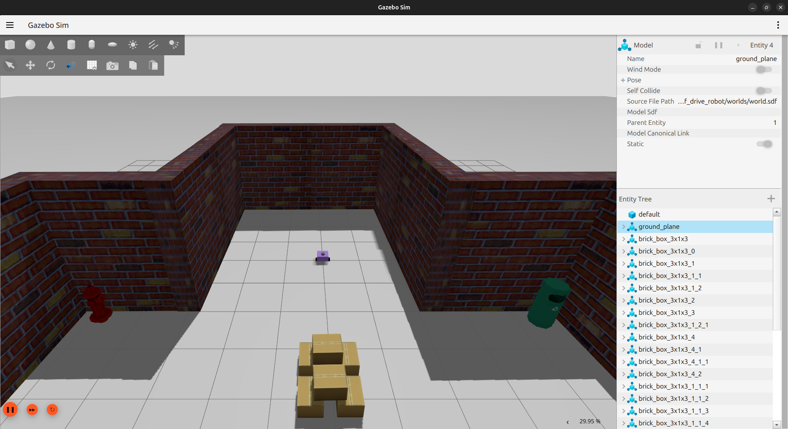
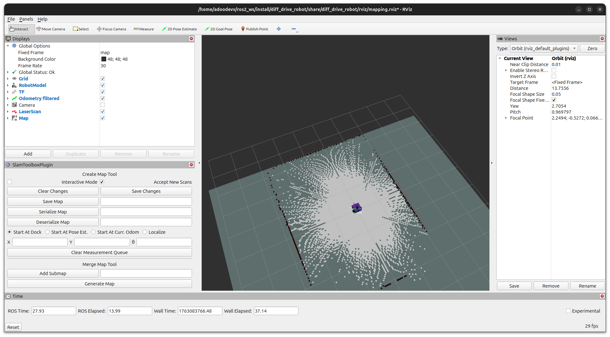

# Simulated Robots Package

This ROS 2 package provides a complete simulation environment for a differential drive robot using Gazebo. It integrates lidar sensor and tele-operated navigation for the robot, as well as full navigation stack for localization (Adaptive Monte Carlo Localization, AMCL), map serving, and sensor bridging, designed specifically as a foundation for advanced control algorithms like Active Inference.

## Branches

This repository has two main branches:

- **`main`**: Base repository with core robot simulation functionality including URDF, Gazebo simulation, and basic tele-operation
- **`mapping`**: Extended branch that adds mapping capabilities using SLAM Toolbox, which can be used for map generation (required for AMCL functionality)


## Work in progress
The package is still being worked on and in development

## Supported on

Supported for [Ubuntu 24.04](https://releases.ubuntu.com/noble/) & [ROS2 Jazzy](https://docs.ros.org/en/jazzy/Installation.html)  compatibility with other versions has not been checked.

## Install Required ROS 2 Packages

### Base Packages (Required for all branches)

Make sure to install the following ROS 2 Jazzy Packages:

```bash
sudo apt install -y \
  ros-jazzy-ros-gz \
  ros-jazzy-ros-gz-bridge \
  ros-jazzy-joint-state-publisher \
  ros-jazzy-robot-state-publisher \
  ros-jazzy-xacro \
  ros-jazzy-nav2-amcl \
  ros-jazzy-nav2-map-server \
  ros-jazzy-nav2-lifecycle-manager \
  ros-jazzy-nav2-msgs \
  ros-jazzy-teleop-twist-keyboard \
  ros-jazzy-teleop-twist-joy
```

### Additional Packages (Required for `mapping` branch)

If you're using the `mapping` branch, also install:

```bash
sudo apt install -y                         \
   ros-jazzy-slam-toolbox                  \
   ros-jazzy-robot-localization
```

## Install

To use this package please download all of the necessary dependencies first and then follow these steps:

### Main Branch

For the robot simulation, clone the main branch:

```bash
mkdir -p ros2_ws/src
cd ros2_ws/src
git clone https://github.com/xaverweid/active_inference_nav_robot.git
cd ..
colcon build --packages-select active_inference_nav_robot --symlink-install
```

## Usage

### Main Branch - Basic Robot Simulation

The primary launch file (robot_launch.py) automates the complex setup required for a mobile robot to "know where it is" within a known environment. It handles everything from spawning the physical model in a virtual world to initializing the particle filter for localization.

After sourcing ROS and this package, launch the 2-wheeled differential drive robot simulation:

```bash
cd ~/ros2_ws
source install/setup.bash
ros2 launch diff_drive_robot robot_launch.py 
```

#### Controlling the robot

If you want to control the robot by keyboard, run this in another terminal:

```bash
ros2 run teleop_twist_keyboard teleop_twist_keyboard 
```



### Mapping Branch - Mapping and Localization - Currently no functionality

The `mapping` branch extends the base functionality with:

- **SLAM Toolbox**: For mapping the environment
- **Enhanced RViz configuration**: Pre-configured for mapping visualization

#### New Configuration Files

The mapping branch includes additional configuration files:

- `config/slam_toolbox_mapping.yaml`: Configuration for SLAM Toolbox mapping mode

#### Launching the Mapping System

The mapping system requires launching two separate terminals:

**Terminal 1 - Robot Simulation:**
```bash
source install/setup.bash
ros2 launch diff_drive_robot robot_launch.py
```

This launches:
- Gazebo simulation
- Robot State Publisher
- Gazebo-ROS bridge
- Robot spawner
- AMCL with map_server and lifecycle_manager

**Terminal 2 - Mapping:**
```bash
source install/setup.bash
ros2 launch diff_drive_robot mapping_launch.py
```

This launches:
- SLAM Toolbox (online async mapping mode)
- RViz with mapping configuration

#### Controlling the robot during mapping

In a third terminal, run the keyboard teleop:

```bash
ros2 run teleop_twist_keyboard teleop_twist_keyboard
```



#### Saving the Map

Once you've mapped your environment, you can save it using the SLAM Toolbox plugin in RViz or via command line:

```bash
ros2 run nav2_map_server map_saver_cli -f ~/my_map
```

## Credits & Acknowledgments

This package utilizes URDF models, Gazebo simulation environments, and base configurations adapted from the diff_drive_robot repository by adoodevv.

Modifications:

    Integrated Nav2 AMCL with automated global localization triggers.
